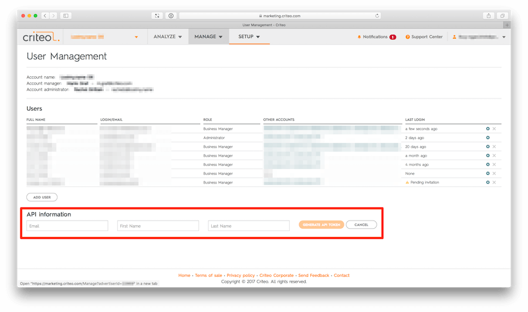

# Criteo Performance Downloader

A Python script for downloading performance data using the [Criteo API](http://kb.criteo.com/advertising/index.php?action=artikel&cat=9&id=27&artlang=en) to local files. 

## Resulting data
By default, it creates two data sets:

1. **Campaign Performance** consists of measures such as impressions, clicks and cost. The script creates one file per day in a specified time rage:

        data/2016/10/30/criteo/campaign-performance-accountname-v1.json.gz
        data/2016/10/31/criteo/campaign-performance-accountname-v1.json.gz

    The resulting JSON files contain arrays of dictionaries per campaign: 

        [
            {
                "campaignID": "1234567",
                "dateTimePosix": "1488240000",
                "dateTime": "2016-10-31",
                "click": "1630",
                "impressions": "61009",
                "CTR": "0.27",
                "revcpc": "0.44",
                "ecpm": "1.18",
                "cost": "717.20",
                "sales": "0",
                "convRate": "0.00",
                "orderValue": "0.00",
                "salesPostView": "0",
                "convRatePostView": "0.00",
                "orderValuePostView": "0.00",
                "costOfSale": "0.00",
                "overallCompetitionWin": "0.60",
                "costPerOrder": "0.00"
            },
        ..
        ]

2. **Account Structure** information. This file is always overwritten by the script:

        data/criteo/criteo-account-structure-accountname-v1.json.gz

    The resulting JSON files contain arrays of dictionaries per campaign: 

        [
            {
                "advertiserName": "Account Name",
                "partner": "criteo",
                "channel": "retargeting",
                "campaignID": 123456,
                "campaignName": "Lower Funnel 2016",
                "campaignBid": {
                "cpaBid": null,
                "cpcBid": {
                    "cpc": 0.76
                },
                "biddingStrategy": "Cpc"
                },
                "budgetID": 56789,
                "remainingDays": 6,
                "status": "RUNNING",
                "categoryBids": [],
                "platform": ""
            },
        ..
        ]

## Getting Started

### Prerequisites

To use the Criteo Performance Downloader you have to create an API token to access the Criteo API. See [Create a Criteo API Token](#create-a-criteo-api-token) for the necessary steps.

### Installation

 The Criteo Performance Downloader requires:

    Python (>= 3.5)
    pycriteo (>0.0.1)
    click (>=6.0)

The easiest way to install criteo-downloader is using pip

    pip install git+https://github.com/mara/criteo-performance-downloader.git --process-dependency-links

In case you want to install it in a virtual environment:

    $ git clone git@github.com:mara/criteo-performance-downloader.git criteo_downloader
    $ cd criteo_downloader
    $ python3 -m venv .venv
    $ .venv/bin/pip install . --process-dependency-links

### Create a Criteo API Token 

**Note: Should you not be able to see the images, please deactivate your adblocker** 

Create an `username`, `passoword` and `token`. As described in [Criteo API integration documentation](https://support.criteo.com/hc/en-us/articles/210162145-How-can-I-manually-generate-an-API-for-my-account-). 

Log into your Criteo Account and go to **Manage -> Users**. Create a new API token:

## Usage

To run the Criteo Performance Downloader call `download-criteo-performance-data` with its config parameters:  

    $ download-criteo-performance-data \
    --accounts accountname username passwort token \
    --accounts accountname2 username2 passwort2 token2 \
    --data_dir /tmp/criteo
    --retry_timeout 10
    --retry_attempts 3

